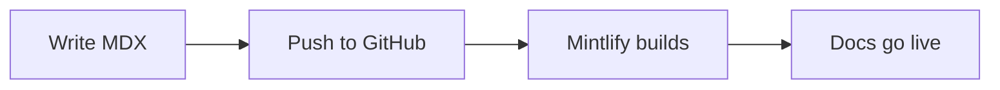

Mintlify gives you a library of ready-made MDX components that go far beyond plain Markdown. Drop them directly into any `.mdx` page to add structured navigation, interactive code examples, visual callouts, API parameter tables, and more — no custom CSS or raw HTML required. Every component is designed to look great in both light and dark mode and stays consistent with your documentation theme.

<Tip>
In the Mintlify web editor, type `/` anywhere in a page to open the slash-command menu and insert any component without leaving the editor.
</Tip>

<CardGroup cols={2}>

<Card title="Callouts" icon="bell" href="/components/callouts">
Highlight important information with `<Note>`, `<Warning>`, `<Tip>`, and `<Info>` blocks that render in distinct colors and icons.
</Card>

<Card title="Cards & CardGroup" icon="rectangle-history" href="/components/cards">
Group navigation links or feature highlights in a responsive grid using `<Card>` and `<CardGroup>`.
</Card>

<Card title="Steps" icon="list-ol" href="/components/steps">
Present sequential instructions as a numbered list with `<Steps>` and `<Step>`, keeping multi-step guides clear and easy to follow.
</Card>

<Card title="Tabs" icon="table-columns" href="/components/tabs">
Organize alternative content — such as different language examples or OS-specific instructions — into switchable panels with `<Tabs>` and `<Tab>`.
</Card>

<Card title="Accordions" icon="chevrons-down" href="/components/accordions">
Collapse optional or advanced content behind a toggle using `<Accordion>` and `<AccordionGroup>` to keep pages concise.
</Card>

<Card title="Code Groups" icon="code" href="/components/code-groups">
Display multiple code blocks in a tabbed view with `<CodeGroup>` — ideal for showing the same example in several languages side by side.
</Card>

<Card title="Frames" icon="image" href="/components/frames">
Wrap images and embeds in a styled container with `<Frame>` to add borders, captions, and consistent sizing.
</Card>

<Card title="Fields" icon="brackets-curly" href="/components/params">
Document API request and response parameters with `<ParamField>` and `<ResponseField>` for structured, scannable API reference pages.
</Card>

<Card title="Expandable" icon="square-chevron-down" href="/components/expandable">
Nest additional detail inside collapsible sections with the `<Expandable>` component to keep your primary content uncluttered.
</Card>

<Card title="Mermaid Diagrams" icon="diagram-project" href="/components/mermaid">
Render flowcharts, sequence diagrams, and entity-relationship diagrams inline using fenced Mermaid code blocks.
</Card>

</CardGroup>

---

## Callouts

Callouts draw attention to important information with four semantic variants: `<Note>` (blue), `<Tip>` (green), `<Warning>` (yellow), and `<Info>` (gray).

```mdx
<Note>
  This is a **note** callout. Use it for supplementary information.
</Note>

<Tip>
  This is a **tip** callout. Use it for helpful suggestions.
</Tip>

<Warning>
  This is a **warning** callout. Use it to flag potential issues.
</Warning>

<Info>
  This is an **info** callout. Use it for neutral contextual information.
</Info>
```

<Note>
This is a **note** callout. Use it for supplementary information.
</Note>

<Tip>
This is a **tip** callout. Use it for helpful suggestions.
</Tip>

<Warning>
This is a **warning** callout. Use it to flag potential issues.
</Warning>

<Info>
This is an **info** callout. Use it for neutral contextual information.
</Info>

---

## Cards & CardGroup

Use `<Card>` to create a clickable tile with a title, icon, and description. Wrap multiple cards in `<CardGroup>` to display them in a responsive grid.

```mdx
<CardGroup cols={2}>
  <Card title="Quickstart" icon="rocket" href="/quickstart">
    Get your documentation site live in under five minutes.
  </Card>
  <Card title="Components" icon="puzzle-piece" href="/components/overview">
    Explore the full component library.
  </Card>
</CardGroup>
```

---

## Steps

Use `<Steps>` to present ordered instructions. Each `<Step>` receives an auto-incremented number and an optional title.

```mdx
<Steps>
  <Step title="Install the CLI">
    Run `npm install -g mintlify` to install the Mintlify CLI globally.
  </Step>
  <Step title="Preview locally">
    Run `mintlify dev` in your docs root to start the local preview server.
  </Step>
  <Step title="Push your changes">
    Commit and push to your connected branch to trigger a deployment.
  </Step>
</Steps>
```

---

## Tabs

Use `<Tabs>` and `<Tab>` to organize content that fits in multiple categories — different programming languages, operating systems, or user roles.

````mdx
<Tabs>
  <Tab title="npm">
    ```bash
    npm install @myorg/sdk
    ```
  </Tab>
  <Tab title="yarn">
    ```bash
    yarn add @myorg/sdk
    ```
  </Tab>
  <Tab title="pnpm">
    ```bash
    pnpm add @myorg/sdk
    ```
  </Tab>
</Tabs>
````

---

## Accordions

Use `<Accordion>` to collapse supplemental content — FAQs, advanced options, or long reference tables — that not every reader needs to see.

```mdx
<AccordionGroup>
  <Accordion title="What is Mintlify?">
    Mintlify is an AI-native documentation platform that turns your MDX files
    into a fast, beautiful documentation site with built-in search and AI assistance.
  </Accordion>
  <Accordion title="How do I deploy?">
    Connect your GitHub or GitLab repository in the Mintlify dashboard. Every
    push to your configured branch triggers an automatic deployment.
  </Accordion>
</AccordionGroup>
```

---

## Code Groups

Use `<CodeGroup>` to display related code blocks in a tabbed panel. Each code block inside a `<CodeGroup>` becomes a separate tab, labeled by its title.

````mdx
<CodeGroup>

```javascript JavaScript
const client = new MintlifyClient({ apiKey: process.env.API_KEY });
```

```python Python
client = MintlifyClient(api_key=os.environ["API_KEY"])
```

```go Go
client := mintlify.NewClient(os.Getenv("API_KEY"))
```

</CodeGroup>
````

---

## Frames

Wrap images and iframes in a `<Frame>` to apply a border, rounded corners, and a drop shadow that matches your documentation theme.

```mdx
<Frame>
  
</Frame>
```

---

## Fields

Use `<ParamField>` for request parameters and `<ResponseField>` for response properties in API reference pages. Both components render a structured table row with type information and an optional default value.

```mdx
<ParamField body="name" type="string" required>
  The display name for the new project.
</ParamField>

<ResponseField name="id" type="string">
  The unique identifier assigned to the created resource.
</ResponseField>
```

---

## Expandable

Use `<Expandable>` to nest additional detail — such as a list of sub-properties — inside a collapsible section within a larger component.

```mdx
<ResponseField name="metadata" type="object">
  Additional metadata attached to the resource.
  <Expandable title="metadata properties">
    <ResponseField name="metadata.createdBy" type="string">
      The ID of the user who created the resource.
    </ResponseField>
    <ResponseField name="metadata.tags" type="string[]">
      An array of tags associated with the resource.
    </ResponseField>
  </Expandable>
</ResponseField>
```

---

## Mermaid diagrams

Render diagrams by writing Mermaid syntax inside a fenced code block with the `mermaid` language tag.

````mdx

````


